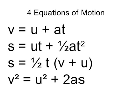

# Physics Application
This is a web application that help you calculation equation of motion
 link: https://jordanleeeee.github.io/equation-of-motion-tool/ 

## Equation of motion
This is a very basic knowledge that every high school student should know when learn basic mechanics.
  
The equations describe the relateion between:
- u,v: initial, final velocity
- t: time 
- a: acceleration
- s: displacement

